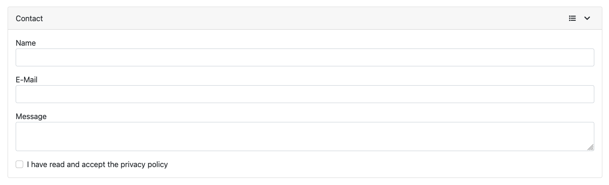

[](https://github.com/germanbisurgi/jedison/actions/workflows/main.yml)
[](https://www.npmjs.com/package/jedison)
[](https://www.npmjs.com/package/jedison)
[](https://bundlephobia.com/package/jedison)
[](https://www.npmjs.com/package/jedison?activeTab=dependencies)
[](https://github.com/germanbisurgi/jedison/blob/main/LICENSE)

<p align="center">
  <a href="https://github.com/germanbisurgi/jedison">
    
  </a>

  <h3 align="center">Jedison</h3>

  <p align="center">
    Framework-agnostic JavaScript library that generates and validates forms from <a href="https://json-schema.org/">JSON Schema</a>.
    <br />
    <a href="https://germanbisurgi.github.io/jedison-docs/"><strong>Explore the docs »</strong></a>
    <br />
    <br />
    <a href="https://germanbisurgi.github.io/jedison/index.html?theme=bootstrap5">View Playground</a>
    &middot;
    <a href="https://github.com/germanbisurgi/jedison/issues">Report Bug</a>
    &middot;
    <a href="https://github.com/germanbisurgi/jedison/issues">Request Feature</a>
  </p>
</p>

## What is Jedison

Jedison generates forms from JSON schemas. Simply provide a JSON schema and Jedison automatically creates a complete, interactive form with built-in validation.

Here's a simple example:

```json
{
  "title": "Contact",
  "type": "object",
  "properties": {
    "name": {
      "title": "Name",
      "type": "string",
      "minLength": 1
    },
    "email": {
      "title": "E-Mail",
      "type": "string",
      "format": "email",
      "minLength": 3
    },
    "message": {
      "title": "Message",
      "type": "string",
      "minLength": 1,
      "x-format": "textarea"
    },
    "gdpr": {
      "title": "I have read and accept the privacy policy",
      "type": "boolean",
      "default": false,
      "const": true,
      "x-format": "checkbox"
    }
  }
}
```

This schema automatically generates a complete contact form:



Jedison helps you validate JSON data on the backend and generate interactive forms from JSON Schemas on the frontend.

**Backend Validation**: Jedison can also be used in headless mode for backend validation in Node.js environments. This is optional - you can use any other JSON schema validator you prefer for server-side validation.

One common workflow looks like this:

1. Your backend sends the JSON Schema to the client
2. Jedison automatically renders a complete form based on the schema
3. Users interact with the form while getting instant client-side validation
4. Validated data gets submitted back to your server
5. The same schema validates the data again server-side for security (using Jedison in headless mode or any other validator)


But Jedison is flexible enough to support other patterns too - you might use it for:

- Standalone client-side forms without server validation
- Pure server-side JSON validation in your backend services (headless mode)
- Hybrid approaches where different parts of the schema are used in different contexts

## Install

### Using ES Module

npm
```bash
npm install jedison
```

yarn
```bash
yarn add jedison
```

```html
<div id="jedison-container"></div>

<script type="module">
    import Jedison from 'jedison'

    const jedison = new Jedison.Create({
        container: document.querySelector('#jedison-container'),
        theme: new Jedison.Theme(),
        schema: {
            "title": "Person",
            "type": "object",
            "properties": {
                "name": {
                    "type": "string",
                    "description": "The person's  name."
                },
                "age": {
                    "description": "Age in years which must be equal to or greater than zero.",
                    "type": "integer",
                    "minimum": 0
                }
            }
        }
    })
</script>
```

### Using fromCDN

```html
<script src="https://cdn.jsdelivr.net/npm/jedison@latest/dist/umd/jedison.umd.js"></script>

<div id="jedison-container"></div>

<script>
    const jedison = new Jedison.Create({
        container: document.querySelector('#jedison-container'),
        theme: new Jedison.Theme(),
        schema: {
            "title": "Person",
            "type": "object",
            "properties": {
                "name": {
                    "type": "string",
                    "description": "The person's  name."
                },
                "age": {
                    "description": "Age in years which must be equal to or greater than zero.",
                    "type": "integer",
                    "minimum": 0
                }
            }
        }
    })
</script>
```

## License

Jedison is released under the MIT License, making it free for commercial and non-commercial use.

## Resources

* [Understanding JSON Schema](https://json-schema.org/understanding-json-schema)
* [JSON-Schema-Test-Suite](https://github.com/json-schema-org/JSON-Schema-Test-Suite)
